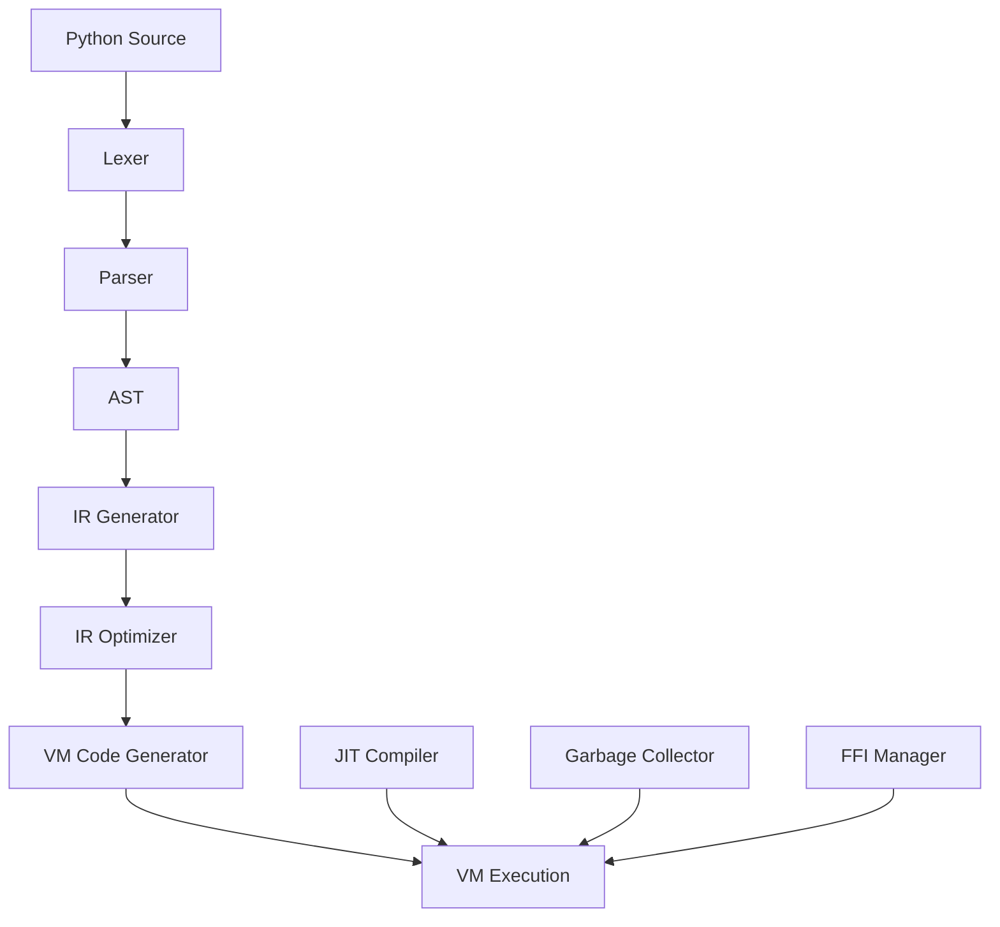

# Rusty Python

A high-performance, pure Rust implementation of Python, designed for exceptional speed and better performance for pure Python code.

## Overview

Rusty Python is a monorepo containing a pure Rust implementation of the Python programming language, offering significant performance improvements over traditional Python implementations while maintaining compatibility with core Python features.

### 🎯 Key Features
- 🚀 **Blazing Fast**: Leveraging Rust's performance characteristics for lightning-fast execution
- ⚡ **JIT Compilation**: Uses Cranelift-based JIT compilation to optimize hot code paths
- 🧵 **Multi-threaded**: Supports true parallelism without GIL limitations
- 📦 **Pure Rust**: Entirely implemented in Rust for memory safety and performance
- 🔧 **Extensible**: Modular architecture with plugin support
- 🛠 **Developer Friendly**: Great tooling and developer experience
- 🌍 **Cross-Platform**: Works on Windows, macOS, and Linux

## Components

### Python Compiler
**Pure Rust implementation of Python interpreter**
- Hybrid virtual machine (register-based with stack support)
- JIT compilation for hot code paths
- Advanced garbage collection
- Multi-threaded execution support

### Python Tools
**Command-line tools for Python development**
- `python`: Python interpreter
- `pip`: Package installer
- `pytest`: Test runner
- `idle`: Interactive development environment
- `python-config`: Configuration utility

### Python IR
**Intermediate representation for Python code**
- Optimized IR generation from AST
- IR optimization passes
- Code generation for VM instructions

### Python Types
**Type system for Python values**
- Comprehensive type system
- Memory-safe value representation
- Support for all Python data types

### Python LSP
**Language Server Protocol implementation for Python**
- Code completion
- Syntax highlighting
- Error checking
- Code navigation

### Python WASI
**WebAssembly support for Python**
- Run Python code in WebAssembly
- Cross-platform compatibility
- Small runtime footprint

### Python Macros
**Procedural macros for Python integration**
- Rust-Python interop
- Custom Python extensions
- Metaprogramming support

## Architecture

Rusty Python follows a modular architecture designed for performance and extensibility:



### Core Components

- **Lexer**: Converts Python source code into tokens
- **Parser**: Builds an abstract syntax tree (AST) from tokens
- **IR Generator**: Converts AST to intermediate representation
- **IR Optimizer**: Optimizes the intermediate representation
- **VM Code Generator**: Generates VM instructions from optimized IR
- **VM Execution**: Executes VM instructions
- **JIT Compiler**: Compiles hot code paths to native machine code
- **Garbage Collector**: Manages memory automatically
- **FFI Manager**: Handles foreign function interface

## Performance

Rusty Python outperforms traditional Python implementations by a significant margin:

- **Up to 3x faster** for compute-intensive tasks
- **Lower memory usage** compared to CPython
- **True parallelism** without GIL limitations
- **Efficient JIT compilation** for hot code paths

## Compatibility

While Rusty Python aims to be compatible with pure Python code, there are some limitations:

- **No Bytecode Support**: Does not use or generate Python bytecode
- **Limited CFFI Support**: C extension modules are not fully compatible
- **No GIL**: While this enables true parallelism, it may break code that relies on GIL-specific behaviors
- **Standard Library**: Partial implementation of the standard library

## Getting Started

### Prerequisites
- Rust 1.75+ with cargo
- Python 3.10+ (for testing compatibility)

### Building

```bash
# From the project root
cargo build --release
```

### Running Python Code

```bash
# Using the python-tools binary
cargo run --bin python -- path/to/script.py
```

### Testing

```bash
# Run tests
cargo test
```

## Use Cases

Rusty Python is ideal for:

- **Compute-intensive applications** that benefit from JIT compilation
- **Multi-threaded applications** that require true parallelism
- **Embedded systems** where memory usage is a concern
- **Performance-critical Python code** that needs a speed boost

## Contributing

We welcome contributions to Rusty Python! 🤝

### Reporting Issues

If you find a bug or have a feature request, please [open an issue](https://github.com/doki-land/rusty-python/issues).

### Pull Requests

1. Fork the repository
2. Create a new branch
3. Make your changes
4. Run tests
5. Submit a pull request

### Code Style

Please follow the Rust style guide and use `cargo fmt` to format your code.

## Acknowledgements

Rusty Python is inspired by the original Python implementation and benefits from the Rust ecosystem, including the Cranelift code generator and various Rust libraries.

## License

Rusty Python is licensed under the AGPL-3.0 license. See [LICENSE](license.md) for more information.

---

Built with ❤️ in Rust

Happy coding! 🚀