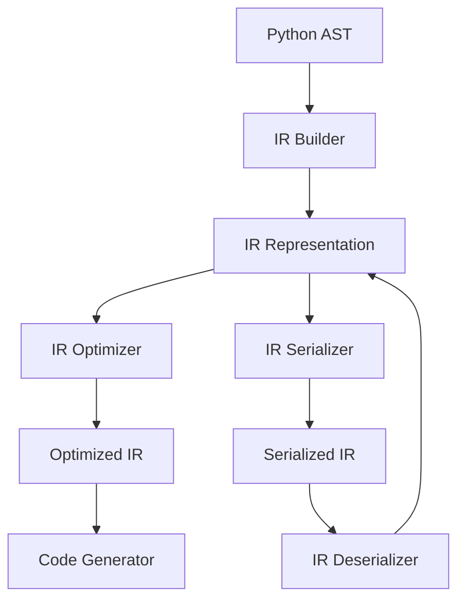

# Python IR

Python Intermediate Representation (IR) for Rusty Python, providing a structured representation of Python code for optimization and code generation.

## Overview

Python IR is a core component of the Rusty Python compiler stack, responsible for converting Python abstract syntax trees (AST) into a more efficient intermediate representation that can be optimized and translated into VM instructions or native code.

## Key Features

### 📋 IR Structure
- **High-level representation**: Captures Python semantics while being more amenable to optimization
- **Type information**: Includes type hints and inference results
- **Control flow analysis**: Explicit representation of control flow structures
- **Optimization-friendly**: Designed to facilitate various compiler optimizations

### 🔧 Core Components
- **IR Builder**: Converts AST to IR
- **IR Optimizer**: Applies various optimizations to the IR
- **IR Serializer**: Supports serialization for cross-component communication
- **IR Validator**: Ensures IR correctness and consistency

## Architecture

The Python IR module follows a clean architecture with clear separation of concerns:



### IR Nodes

The IR is composed of various node types representing different Python constructs:

- **Expressions**: Literals, variables, function calls, operations
- **Statements**: Assignments, control flow, loops, function definitions
- **Modules**: Python modules and their contents
- **Classes**: Class definitions and their methods

## Usage

### Basic Usage

```rust
use python_ir::builder::IRBuilder;
use python_parser::parse;

// Parse Python code into AST
let source = "def add(a, b): return a + b";
let ast = parse(source).unwrap();

// Build IR from AST
let mut builder = IRBuilder::new();
let ir = builder.build(&ast).unwrap();

// Optimize IR
let optimized_ir = ir.optimize();

// Generate code from optimized IR
// ...
```

### IR Optimization

The IR optimizer applies various optimizations:

- **Constant folding**: Evaluate constant expressions at compile time
- **Dead code elimination**: Remove unreachable code
- **Common subexpression elimination**: Avoid redundant computations
- **Inlining**: Inline small functions for better performance

## Performance Benefits

Using a well-designed IR provides several performance benefits:

- **Faster compilation**: IR is easier to optimize than raw AST
- **Better runtime performance**: Optimized IR leads to more efficient code
- **Cross-platform compatibility**: IR is platform-independent
- **Extensibility**: Easy to add new optimizations and code generators

## Integration

Python IR integrates seamlessly with other components of the Rusty Python ecosystem:

- **oak-python**: Provides AST input
- **python-types**: Provides type information
- **python-compiler**: Uses IR for code generation
- **python-vm**: Executes code generated from IR

## Contributing

Contributions to the Python IR module are welcome! Here are some ways to contribute:

- **Adding new optimizations**: Implement new IR optimization passes
- **Improving IR structure**: Enhance the IR to better capture Python semantics
- **Adding serialization formats**: Support additional serialization methods
- **Writing tests**: Add comprehensive tests for IR functionality

## License

Python IR is licensed under the AGPL-3.0 license. See [LICENSE](../../../license.md) for more information.

---

Built with ❤️ in Rust

Happy coding! 🚀