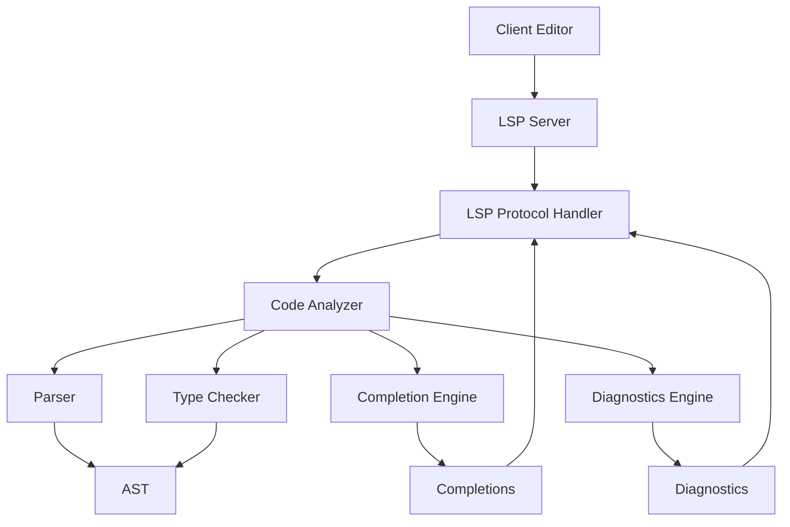

# Python LSP

Python Language Server Protocol (LSP) implementation for Rusty Python, providing language server features for Python code editing and development.

## Overview

Python LSP is a comprehensive implementation of the Language Server Protocol (LSP) for Python, designed to provide intelligent code editing features, such as code completion, hover information, and diagnostics, for Rusty Python and other Python implementations.

## Key Features

### 📋 Language Server Features
- **Code Completion**: Intelligent suggestions for variables, functions, and modules
- **Hover Information**: Documentation and type information on hover
- **Go to Definition**: Jump to the definition of symbols
- **Find References**: Locate all references to a symbol
- **Code Diagnostics**: Real-time error and warning detection
- **Code Actions**: Suggestions for fixing issues
- **Document Formatting**: Automatic code formatting
- **Signature Help**: Parameter information for function calls

### 🔧 Core Components
- **LSP Server**: Implements the LSP protocol
- **Parser Integration**: Uses Python parser for code analysis
- **Type Checker**: Provides type information and validation
- **Completion Engine**: Generates intelligent code completions
- **Diagnostics Engine**: Detects and reports code issues

## Architecture

The Python LSP module follows a modular architecture with clear separation of concerns:



### Language Server Capabilities

The Python LSP server supports the following LSP capabilities:

- **Text Document Synchronization**: Keeps the server in sync with client documents
- **Completion**: Provides code completion suggestions
- **Hover**: Shows information about symbols on hover
- **Signature Help**: Shows parameter information for functions
- **Definition**: Finds the definition of symbols
- **References**: Finds all references to symbols
- **Document Highlight**: Highlights occurrences of symbols in the document
- **Document Symbol**: Provides an outline of the document
- **Code Action**: Suggests fixes for issues
- **Code Lens**: Shows additional information in the editor
- **Document Formatting**: Formats the entire document
- **Document Range Formatting**: Formats a specific range
- **Rename**: Renames symbols across the codebase

## Usage

### Basic Usage

```rust
use python_lsp::server::PythonLanguageServer;
use lsp_server::Connection;

// Create a connection to the client
let (connection, io_threads) = Connection::stdio();

// Create the language server
let server = PythonLanguageServer::new();

// Start handling requests
server.run(connection).unwrap();

// Wait for IO threads to finish
io_threads.join().unwrap();
```

### Client Configuration

Clients can configure the Python LSP server with the following settings:

- **python.lsp.enable**: Enable/disable the language server
- **python.lsp.diagnostics.enable**: Enable/disable diagnostics
- **python.lsp.completion.enable**: Enable/disable code completion
- **python.lsp.hover.enable**: Enable/disable hover information
- **python.lsp.formatting.enable**: Enable/disable code formatting

## Integration

Python LSP integrates seamlessly with other components of the Rusty Python ecosystem:

- **oak-python**: Provides code parsing capabilities
- **python-types**: Provides type information
- **python-ir**: Provides intermediate representation for analysis
- **Editor Clients**: Integrates with various code editors

## Supported Editors

Python LSP can be used with any editor that supports the Language Server Protocol, including:

- **Visual Studio Code**: via the Python extension
- **Sublime Text**: via LSP plugin
- **Vim/Neovim**: via coc.nvim or languageclient-neovim
- **Emacs**: via lsp-mode
- **Atom**: via atom-ide-ui

## Performance

Python LSP is designed for performance and responsiveness:

- **Incremental parsing**: Only parses changed parts of files
- **Caching**: Caches analysis results for faster responses
- **Background processing**: Performs heavy analysis in the background
- **Parallel processing**: Uses multiple threads for concurrent analysis

## Contributing

Contributions to the Python LSP module are welcome! Here are some ways to contribute:

- **Adding new features**: Implement new LSP capabilities
- **Improving performance**: Optimize the server for faster responses
- **Enhancing code analysis**: Improve the quality of code analysis
- **Adding editor integrations**: Create integrations for new editors
- **Writing tests**: Add comprehensive tests for LSP functionality

## License

Python LSP is licensed under the AGPL-3.0 license. See [LICENSE](../../../license.md) for more information.

---

Built with ❤️ in Rust

Happy coding! 🚀