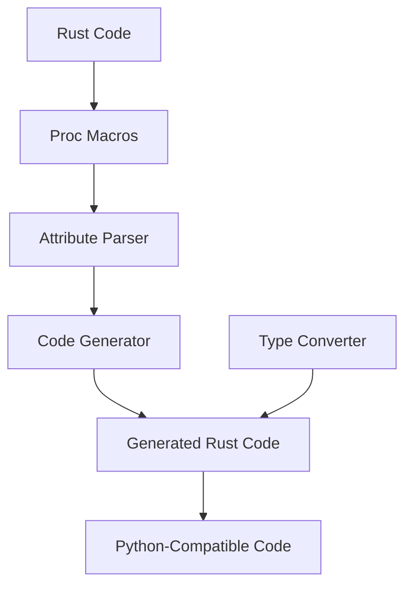

# Python Macros

Python macro support for Rusty Python, providing procedural macros for Python code generation and manipulation.

## Overview

Python Macros is a collection of procedural macros for Rust that enable seamless integration between Rust and Python code. These macros simplify the process of generating Python code from Rust, handling Python types, and working with Python's dynamic features.

## Key Features

### 📋 Macro Types
- **#[python_function]**: Converts Rust functions to Python callables
- **#[python_class]**: Defines Python classes from Rust structs
- **#[python_module]**: Creates Python modules from Rust code
- **#[python_enum]**: Converts Rust enums to Python enum-like objects
- **#[python_derive]**: Derives Python-specific traits for Rust types

### 🔧 Core Components
- **Proc Macros**: Procedural macros for code generation
- **Attribute Parsers**: Parse macro attributes and arguments
- **Code Generators**: Generate Python-compatible Rust code
- **Type Converters**: Handle type conversions between Rust and Python

## Architecture

The Python Macros module follows a modular architecture with clear separation of concerns:



### Macro Processing Flow

1. **Attribute Parsing**: Parse macro attributes and arguments
2. **Code Analysis**: Analyze the decorated Rust code
3. **Code Generation**: Generate Python-compatible Rust code
4. **Type Handling**: Add type conversion logic
5. **Module Integration**: Integrate with Python module system

## Usage

### Basic Usage

#### Python Function Macro

```rust
use python_macros::python_function;

#[python_function]
pub fn add(a: i32, b: i32) -> i32 {
    a + b
}
```

#### Python Class Macro

```rust
use python_macros::python_class;

#[python_class]
pub struct Point {
    x: f64,
    y: f64,
}

#[python_class]
impl Point {
    #[python_function]
    pub fn new(x: f64, y: f64) -> Self {
        Self { x, y }
    }

    #[python_function]
    pub fn distance(&self, other: &Point) -> f64 {
        let dx = self.x - other.x;
        let dy = self.y - other.y;
        (dx * dx + dy * dy).sqrt()
    }
}
```

#### Python Module Macro

```rust
use python_macros::python_module;

#[python_module(name = "math")]
pub mod math_module {
    use python_macros::python_function;

    #[python_function]
    pub fn add(a: f64, b: f64) -> f64 {
        a + b
    }

    #[python_function]
    pub fn subtract(a: f64, b: f64) -> f64 {
        a - b
    }
}
```

## Integration

Python Macros integrates seamlessly with other components of the Rusty Python ecosystem:

- **python-types**: Provides type information and conversion
- **python-ir**: Used for code analysis and generation
- **python-compiler**: Integrates generated code into the Python runtime
- **Rust Code**: Enables Rust code to be called from Python

## Performance

Python Macros is designed for performance and efficiency:

- **Compile-time code generation**: Generates efficient code at compile time
- **Zero runtime overhead**: No additional runtime cost for macro usage
- **Optimized type conversions**: Efficient conversion between Rust and Python types
- **Minimal dependencies**: Only requires necessary dependencies

## Benefits

Using Python Macros provides several benefits:

- **Seamless integration**: Easy integration between Rust and Python code
- **Type safety**: Maintains Rust's type safety while working with Python
- **Performance**: Generated code is efficient and optimized
- **Productivity**: Reduces boilerplate code and simplifies development
- **Flexibility**: Supports a wide range of Python integration scenarios

## Contributing

Contributions to the Python Macros module are welcome! Here are some ways to contribute:

- **Adding new macros**: Implement new procedural macros for Python integration
- **Improving existing macros**: Enhance the functionality of existing macros
- **Adding type conversions**: Support more Rust and Python types
- **Writing tests**: Add comprehensive tests for macro functionality
- **Improving documentation**: Enhance documentation and examples

## License

Python Macros is licensed under the AGPL-3.0 license. See [LICENSE](../../../license.md) for more information.

---

Built with ❤️ in Rust

Happy coding! 🚀