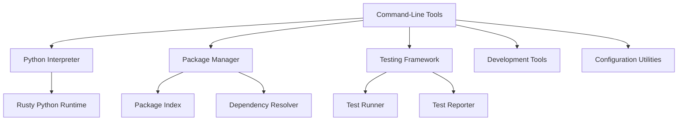

# Python Tools

A collection of Python language tools for the Rusty Python ecosystem, including the Python interpreter, package manager, and development utilities.

## Overview

Python Tools provides a comprehensive set of command-line tools for working with Python code in the Rusty Python ecosystem. These tools are designed to be compatible with standard Python tools while leveraging the performance and safety of Rust.

## Key Features

### 📋 Command-Line Tools
- **python**: Python interpreter for executing Python code
- **python3**: Alias for the Python interpreter
- **pip**: Package manager for installing Python packages
- **pytest**: Testing framework for Python code
- **idle**: Simple IDE for Python development
- **python-config**: Utility for getting Python configuration information

### 🔧 Core Components
- **Interpreter**: Executes Python code using the Rusty Python runtime
- **Package Manager**: Handles package installation and management
- **Testing Framework**: Runs tests and reports results
- **Development Tools**: Provides utilities for Python development
- **Configuration Utilities**: Helps with Python environment configuration

## Architecture

The Python Tools module follows a modular architecture with clear separation of concerns:



### Tool Details

#### Python Interpreter (`python` / `python3`)
- **Execution**: Runs Python scripts and interactive sessions
- **Compatibility**: Supports standard Python syntax and features
- **Performance**: Leverages Rusty Python's optimized runtime
- **Extensions**: Supports Python extensions written in Rust

#### Package Manager (`pip`)
- **Installation**: Installs Python packages from package indexes
- **Dependency Management**: Resolves and installs dependencies
- **Package Discovery**: Searches for packages in indexes
- **Version Control**: Manages package versions

#### Testing Framework (`pytest`)
- **Test Discovery**: Finds and runs tests automatically
- **Test Execution**: Runs tests in isolation
- **Result Reporting**: Provides detailed test results
- **Test Fixtures**: Supports setup and teardown for tests

#### Development Environment (`idle`)
- **Code Editor**: Simple editor for Python code
- **Syntax Highlighting**: Highlights Python syntax
- **Auto-completion**: Provides code completion suggestions
- **Interactive Shell**: Integrated Python shell

#### Configuration Utility (`python-config`)
- **Compiler Flags**: Provides compiler flags for Python extensions
- **Linker Flags**: Provides linker flags for Python extensions
- **Include Paths**: Shows include paths for Python headers
- **Library Paths**: Shows library paths for Python libraries

## Usage

### Basic Usage

#### Running Python Code

```bash
# Run a Python script
python script.py

# Start an interactive Python shell
python
```

#### Installing Packages

```bash
# Install a package
pip install package_name

# Install a specific version
pip install package_name==1.0.0

# Upgrade a package
pip install --upgrade package_name

# Uninstall a package
pip uninstall package_name
```

#### Running Tests

```bash
# Run all tests in the current directory
pytest

# Run specific tests
pytest test_file.py

# Run tests with verbose output
pytest -v
```

#### Using the Development Environment

```bash
# Start the IDLE development environment
idle
```

#### Getting Configuration Information

```bash
# Get compiler flags
python-config --cflags

# Get linker flags
python-config --ldflags

# Get include paths
python-config --includes

# Get library paths
python-config --libs
```

## Integration

Python Tools integrates seamlessly with other components of the Rusty Python ecosystem:

- **python**: Uses the Rusty Python runtime for execution
- **python-types**: Provides type information for Python code
- **python-ir**: Used for code analysis and optimization
- **python-lsp**: Provides language server features for editors

## Performance

Python Tools is designed for performance and efficiency:

- **Fast Execution**: Leverages Rusty Python's optimized runtime
- **Low Overhead**: Minimal startup time and memory usage
- **Parallel Processing**: Uses multiple threads for concurrent operations
- **Efficient I/O**: Optimized for fast file operations

## Benefits

Using Python Tools provides several benefits:

- **Compatibility**: Compatible with standard Python tools and workflows
- **Performance**: Faster execution than traditional Python tools
- **Safety**: Built with Rust's memory safety guarantees
- **Extensibility**: Easy to extend with new tools and features
- **Integration**: Seamlessly integrates with the Rusty Python ecosystem

## Contributing

Contributions to the Python Tools module are welcome! Here are some ways to contribute:

- **Adding new tools**: Implement new command-line tools for Python development
- **Improving existing tools**: Enhance the functionality of existing tools
- **Adding features**: Add new features to existing tools
- **Writing tests**: Add comprehensive tests for tool functionality
- **Improving documentation**: Enhance documentation and examples

## License

Python Tools is licensed under the AGPL-3.0 license. See [LICENSE](../../../license.md) for more information.

---

Built with ❤️ in Rust

Happy coding! 🚀