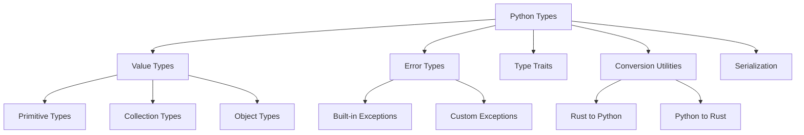

# Python Types

Python value and error types for Rusty Python, providing a comprehensive type system for Python values and exceptions.

## Overview

Python Types is a core component of the Rusty Python ecosystem, providing a type system that represents Python values and exceptions in Rust. This module enables seamless type conversion between Rust and Python, and provides a foundation for other components like the interpreter, compiler, and language server.

## Key Features

### 📋 Type System
- **Python Value Types**: Represent Python values in Rust
- **Error Types**: Represent Python exceptions and errors
- **Type Conversion**: Convert between Rust and Python types
- **Type Checking**: Validate and check Python types
- **Serialization**: Serialize and deserialize Python types

### 🔧 Core Components
- **Value Types**: Represent Python values like integers, strings, lists, dictionaries, etc.
- **Error Types**: Represent Python exceptions and error conditions
- **Type Traits**: Define interfaces for Python types
- **Conversion Utilities**: Convert between Rust and Python types
- **Serialization Support**: Serialize Python types to JSON and other formats

## Architecture

The Python Types module follows a modular architecture with clear separation of concerns:



### Value Types

The module provides a comprehensive set of types to represent Python values:

- **Primitive Types**: Integers, floats, booleans, strings, None
- **Collection Types**: Lists, tuples, dictionaries, sets
- **Object Types**: Classes, instances, functions, methods
- **Special Types**: Modules, code objects, frame objects

### Error Types

The module includes support for Python's exception hierarchy:

- **Built-in Exceptions**: BaseException, Exception, TypeError, ValueError, etc.
- **Custom Exceptions**: User-defined exceptions
- **Error Propagation**: Propagate exceptions between Rust and Python

## Usage

### Basic Usage

#### Working with Python Values

```rust
use python_types::value::{PyValue, PyInt, PyString};

// Create Python values
let py_int = PyInt::new(42);
let py_str = PyString::new("Hello, world!");

// Convert to generic PyValue
let value1: PyValue = py_int.into();
let value2: PyValue = py_str.into();

// Check types
if value1.is_int() {
    println!("Value is an integer");
}

// Extract values
if let Some(int_value) = value1.as_int() {
    println!("Integer value: {}", int_value);
}
```

#### Working with Exceptions

```rust
use python_types::error::{PyError, PyTypeError};

// Create exceptions
let type_error = PyTypeError::new("Invalid type");

// Convert to generic PyError
let error: PyError = type_error.into();

// Handle exceptions
match error {
    PyError::TypeError(e) => println!("Type error: {}", e.message()),
    PyError::ValueError(e) => println!("Value error: {}", e.message()),
    _ => println!("Other error"),
}
```

#### Type Conversion

```rust
use python_types::convert::{ToPyValue, FromPyValue};

// Convert Rust types to Python values
let rust_int = 42;
let py_int = rust_int.to_py_value();

let rust_str = "Hello";
let py_str = rust_str.to_py_value();

// Convert Python values to Rust types
let py_value: PyValue = PyInt::new(100).into();
let rust_int: i32 = py_value.from_py_value().unwrap();
```

## Integration

Python Types integrates seamlessly with other components of the Rusty Python ecosystem:

- **python**: Uses Python types for value representation
- **python-ir**: Uses Python types for IR generation
- **python-lsp**: Uses Python types for code analysis
- **python-macros**: Uses Python types for macro expansion

## Performance

Python Types is designed for performance and efficiency:

- **Zero-Copy Operations**: Minimize memory copies when converting types
- **Efficient Memory Management**: Uses Rust's ownership system for memory management
- **Fast Type Checking**: Optimized for quick type checks
- **Serialization Performance**: Efficient serialization and deserialization

## Benefits

Using Python Types provides several benefits:

- **Type Safety**: Maintains type safety while working with dynamic Python values
- **Seamless Integration**: Easy integration between Rust and Python code
- **Performance**: Efficient representation and conversion of Python types
- **Extensibility**: Easy to extend with new types and conversions
- **Compatibility**: Compatible with standard Python types and semantics

## Contributing

Contributions to the Python Types module are welcome! Here are some ways to contribute:

- **Adding new types**: Implement support for additional Python types
- **Improving conversions**: Enhance type conversion between Rust and Python
- **Adding serialization formats**: Support additional serialization methods
- **Writing tests**: Add comprehensive tests for type functionality
- **Improving documentation**: Enhance documentation and examples

## License

Python Types is licensed under the AGPL-3.0 license. See [LICENSE](../../../license.md) for more information.

---

Built with ❤️ in Rust

Happy coding! 🚀