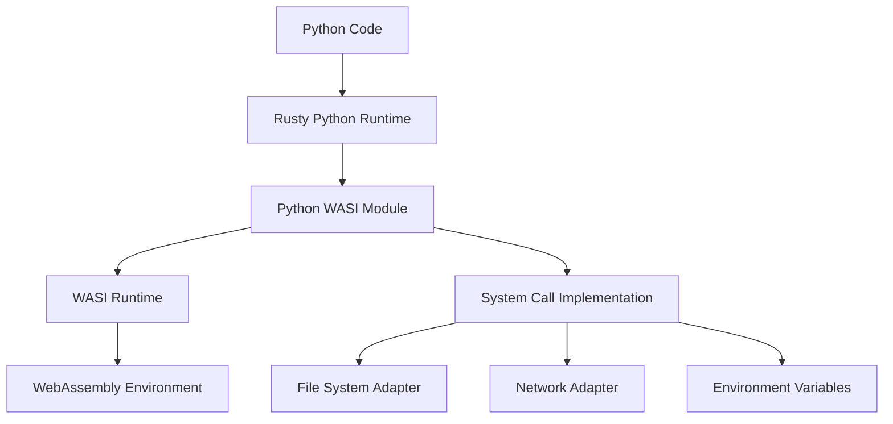

# Python WASI

Python WebAssembly (WASI) support for Rusty Python, enabling Python code to run in WebAssembly environments.

## Overview

Python WASI is a module that enables Rusty Python to run in WebAssembly environments using the WebAssembly System Interface (WASI). This allows Python code to be executed in browsers, serverless environments, and other WebAssembly-compatible platforms.

## Key Features

### 📋 WASI Integration
- **WASI Runtime**: Runs Python code in WebAssembly environments
- **System Interface**: Implements WASI system calls for Python
- **File System Access**: Supports WASI file system operations
- **Network Access**: Supports WASI network operations
- **Environment Variables**: Handles WASI environment variables

### 🔧 Core Components
- **WASI Runtime**: Integrates with WASI-compatible runtimes
- **System Call Implementation**: Implements Python's system calls via WASI
- **File System Adapter**: Adapts Python's file operations to WASI
- **Network Adapter**: Adapts Python's network operations to WASI
- **Memory Management**: Optimizes memory usage for WebAssembly

## Architecture

The Python WASI module follows a modular architecture with clear separation of concerns:



### WASI Integration

The module integrates with various WASI runtimes:

- **Wasmer**: Fast and secure WebAssembly runtime
- **Wasmtime**: Lightweight and configurable WebAssembly runtime
- **WASI SDK**: Official WASI SDK for WebAssembly development
- **Browser-based WASI**: WebAssembly in browsers via WebAssembly.instantiate

## Usage

### Basic Usage

#### Building for WASI

```bash
# Install WASI target
rustup target add wasm32-wasi

# Build Python WASI
cargo build --target wasm32-wasi --release
```

#### Running in Wasmer

```bash
# Install Wasmer
curl https://get.wasmer.io -sSfL | sh

# Run Python WASI
wasmer run target/wasm32-wasi/release/python-wasi.wasm -- script.py
```

#### Running in Wasmtime

```bash
# Install Wasmtime
curl https://wasmtime.dev/install.sh -sSf | bash

# Run Python WASI
wasmtime run target/wasm32-wasi/release/python-wasi.wasm -- script.py
```

#### Running in Browser

```javascript
// Load and instantiate the WASI module
const response = await fetch('python-wasi.wasm');
const buffer = await response.arrayBuffer();
const module = await WebAssembly.compile(buffer);

// Create WASI instance
const wasi = new WebAssembly.Wasi({
  args: ['python', 'script.py'],
  env: {},
  preopens: {
    '/': '/'
  }
});

// Instantiate with WASI
const instance = await WebAssembly.instantiate(module, {
  wasi_snapshot_preview1: wasi.wasiImport
});

// Start execution
wasi.start(instance);
```

## Features

### Supported Python Features

- **Core Python Syntax**: Full support for Python language syntax
- **Standard Data Types**: Numbers, strings, lists, dictionaries, tuples, etc.
- **Control Flow**: If-else, loops, functions, classes
- **Exception Handling**: Try-except blocks
- **Built-in Functions**: Core built-ins like print, len, etc.

### WASI-Specific Features

- **File System Operations**: Read, write, and manipulate files
- **Network Operations**: Make HTTP requests and handle sockets
- **Environment Variables**: Access and modify environment variables
- **Command-Line Arguments**: Handle command-line arguments
- **Exit Codes**: Set and return exit codes

## Performance

Python WASI is designed for performance in WebAssembly environments:

- **Optimized Memory Usage**: Efficient memory management for WebAssembly
- **Lazy Loading**: Loads modules only when needed
- **JIT Compilation**: Leverages WebAssembly JIT compilers when available
- **Asynchronous Operations**: Supports async I/O for better performance

## Use Cases

Python WASI is ideal for:

- **Browser Applications**: Run Python code directly in web browsers
- **Serverless Functions**: Deploy Python functions as WebAssembly modules
- **Edge Computing**: Run Python code at the edge for low latency
- **IoT Devices**: Run Python code on resource-constrained devices
- **Cross-Platform Development**: Write once, run anywhere with WebAssembly

## Integration

Python WASI integrates seamlessly with other components of the Rusty Python ecosystem:

- **python**: Uses the Rusty Python runtime
- **python-types**: Uses Python types for value representation
- **python-ir**: Uses IR for code optimization
- **WebAssembly Tools**: Integrates with WebAssembly build tools

## Limitations

While Python WASI provides comprehensive support for Python in WebAssembly, there are some limitations:

- **Performance**: WebAssembly execution may be slower than native execution
- **Memory Constraints**: WebAssembly has memory limitations
- **System Calls**: Not all system calls are available in WASI
- **C Extensions**: C extensions may not work in WebAssembly
- **Threading**: Limited threading support in WebAssembly

## Contributing

Contributions to the Python WASI module are welcome! Here are some ways to contribute:

- **Adding WASI Features**: Implement support for additional WASI features
- **Improving Performance**: Optimize Python WASI for WebAssembly
- **Adding Platform Support**: Support more WASI runtimes and platforms
- **Writing Tests**: Add comprehensive tests for WASI functionality
- **Improving Documentation**: Enhance documentation and examples

## License

Python WASI is licensed under the AGPL-3.0 license. See [LICENSE](../../../license.md) for more information.

---

Built with ❤️ in Rust

Happy coding! 🚀