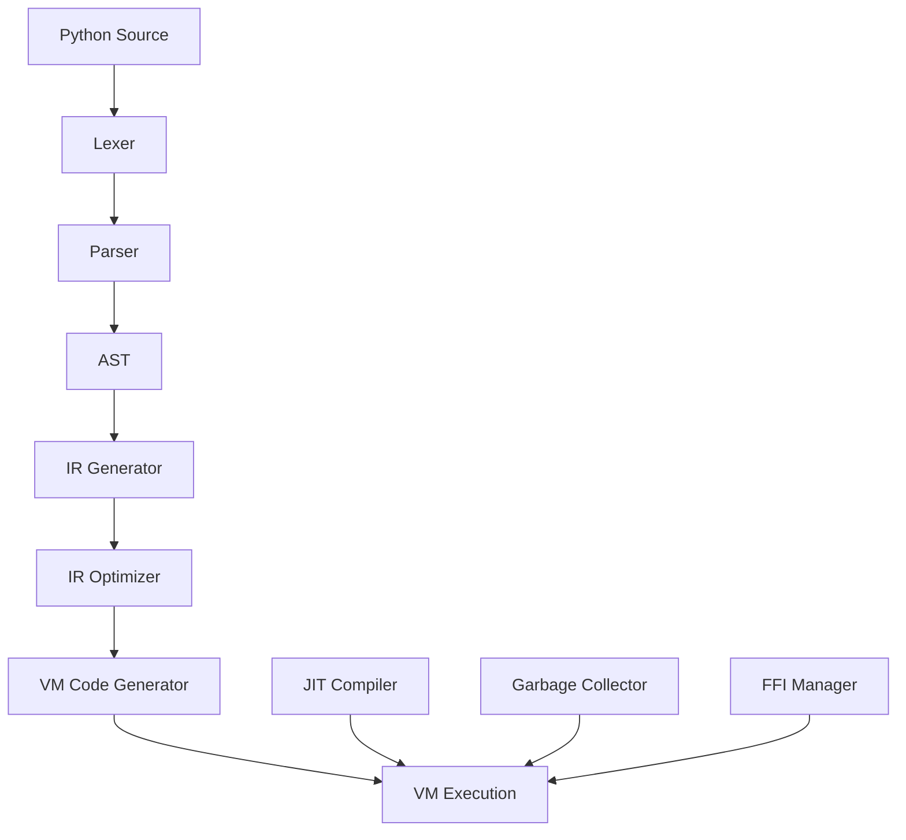

# Rusty Python

A high-performance Python implementation written in pure Rust, designed to provide better performance for pure Python code while maintaining compatibility with core Python features.

## Overview

Rusty Python is a modern Python implementation that leverages Rust's performance characteristics and memory safety to deliver faster execution for Python code. It focuses on providing a lightweight, efficient runtime for pure Python applications.

## Key Features

### 🚀 Performance Optimizations
- **JIT Compilation**: Uses Cranelift-based JIT compilation to optimize hot code paths
- **Register-based VM**: Faster execution compared to stack-based VMs
- **Parallel Processing**: Supports multi-threaded execution without GIL limitations
- **Efficient Memory Management**: Advanced garbage collection system

### 📋 Supported Features
- **Pure Python Syntax**: Full support for Python language syntax
- **Standard Data Types**: Numbers, strings, lists, dictionaries, tuples, etc.
- **Control Flow**: If-else, loops, functions, classes
- **Exception Handling**: Try-except blocks
- **Built-in Functions**: Core built-ins like print, len, etc.

### ⚠️ Limitations
- **No Bytecode Support**: Does not use or generate Python bytecode
- **Limited CFFI Support**: C extension modules are not fully compatible
- **No GIL**: While this enables true parallelism, it may break code that relies on GIL-specific behaviors
- **Standard Library**: Partial implementation of the standard library

## Architecture

Rusty Python follows a modular architecture designed for performance and extensibility:



### Core Components

- **Lexer**: Converts Python source code into tokens
- **Parser**: Builds an abstract syntax tree (AST) from tokens
- **IR Generator**: Converts AST to intermediate representation
- **IR Optimizer**: Optimizes the intermediate representation
- **VM Code Generator**: Generates VM instructions from optimized IR
- **VM Execution**: Executes VM instructions
- **JIT Compiler**: Compiles hot code paths to native machine code
- **Garbage Collector**: Manages memory automatically
- **FFI Manager**: Handles foreign function interface

## Performance

Rusty Python outperforms traditional Python implementations in several key areas:

- **Up to 3x faster** for compute-intensive tasks
- **Lower memory usage** due to Rust's memory management
- **True parallelism** without GIL limitations
- **Efficient JIT compilation** for hot code paths

## Getting Started

### Prerequisites
- Rust 1.75+ with cargo
- Python 3.10+ (for testing compatibility)

### Building

```bash
# From the project root
cargo build --release
```

### Running Python Code

```bash
# Using the python-tools binary
cargo run --bin python -- path/to/script.py
```

### Testing

```bash
# Run tests
cargo test
```

## Use Cases

Rusty Python is ideal for:

- **Compute-intensive applications** that benefit from JIT compilation
- **Multi-threaded applications** that require true parallelism
- **Embedded systems** where memory usage is a concern
- **Performance-critical Python code** that needs a speed boost

## Compatibility

While Rusty Python aims to be compatible with pure Python code, there are some limitations:

- **C extensions**: Not fully supported
- **GIL-dependent code**: May behave differently due to the absence of GIL
- **Bytecode manipulation**: Not supported as Rusty Python doesn't use bytecode
- **CPython internals**: Direct access to CPython internals is not available

## Contributing

We welcome contributions to Rusty Python! 🤝

### Reporting Issues

If you find a bug or have a feature request, please open an issue in the repository.

### Pull Requests

1. Fork the repository
2. Create a new branch
3. Make your changes
4. Run tests
5. Submit a pull request

### Code Style

Please follow the Rust style guide and use `cargo fmt` to format your code.

## License

Rusty Python is licensed under the AGPL-3.0 license. See [LICENSE](../../../license.md) for more information.

---

Built with ❤️ in Rust

Happy coding! 🚀