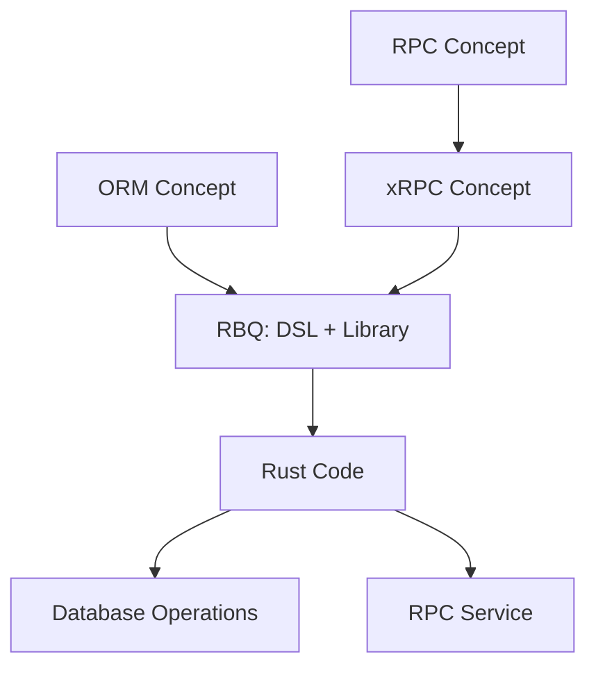

# Concepts Guide

This section introduces the core concepts of RBQ, including ORM, RPC, xRPC, etc., to help you understand RBQ's design philosophy and technical architecture.

## Concept Relationship Diagram

## Core Concepts

### ORM (Object-Relational Mapping)

ORM is a programming technique used in object-oriented programming languages to establish a mapping relationship between data in relational databases and object models. It allows developers to manipulate databases in an object-oriented way without directly writing SQL statements.

### RPC (Remote Procedure Call)

RPC is a communication protocol that allows a program to call a subroutine in another address space (usually another computer on the network) without the programmer explicitly encoding the details of this remote call.

### xRPC

xRPC is a high-performance RPC framework concept, which is one of the core design concepts of RBQ. xRPC emphasizes:
- High Performance: Adopting lock-free design, zero-copy serialization
- Simple Protocol: Custom simple frame protocol, avoiding the complexity of HTTP/2
- Flexible Extension: Modular design, supporting multiple transport layers and serialization methods
- Integration with ORM: As part of the RBQ DSL, implementing unified definition of models and RPC services

### RBQ

RBQ (Rust Business Query) is:
1. **A DSL Language**: Designed specifically for xRPC, unifying data model definition and RPC service definition
2. **A Rust Library**: Implements the xRPC concept, providing an integrated ORM + RPC solution

Through compile-time code generation, RBQ converts `.rbq` files into high-performance Rust code, including data models, database operations, and RPC services.