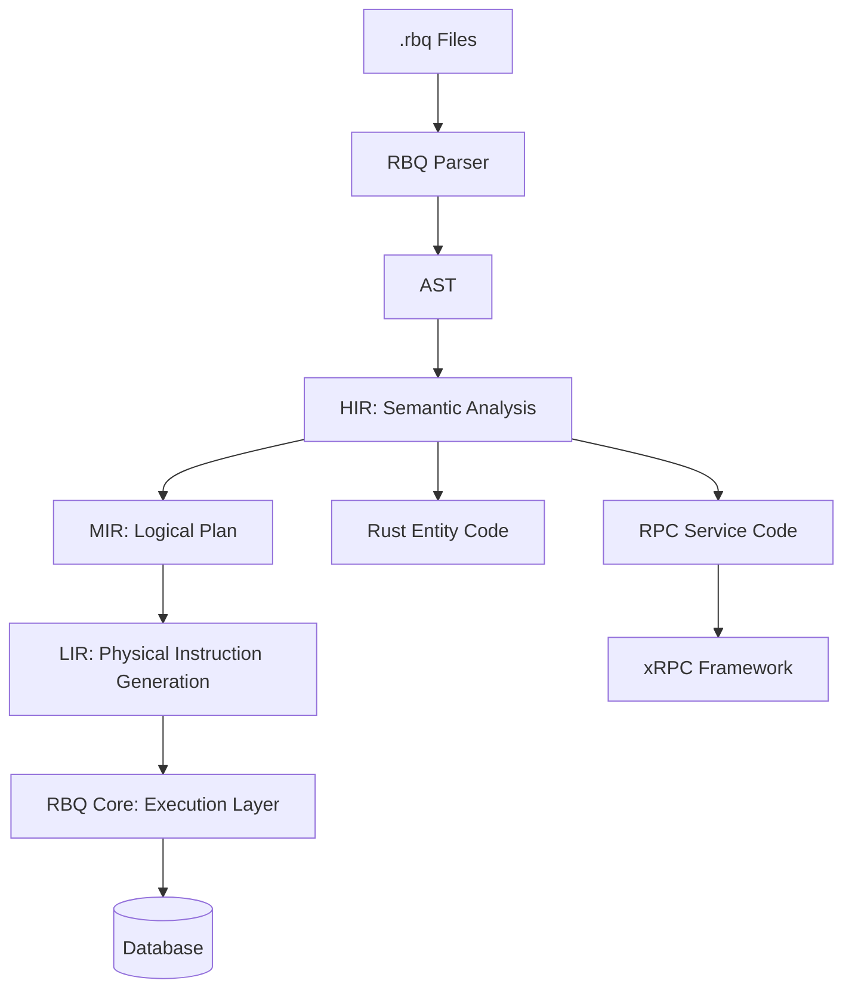

# Introduction

RBQ (Rust Business Query) is:

1. **A DSL Language**: Designed specifically for xRPC, unifying data model definition and RPC service definition
2. **A Rust Library**: Implements the xRPC concept, providing an integrated ORM + RPC solution

RBQ aims to provide a unified, stable, and high-performance ORM + RPC integrated solution for the Rust ecosystem. Through compile-time code generation, it converts `.rbq` files into high-performance Rust code.

## 🚀 Project Vision

We focus on:
- **Declarative**: Using Rust-like syntax, easy to learn and read.
- **Zero Overhead**: Compile-time generation of optimal Rust code, no runtime reflection.
- **Integration**: Models and RPC in the same file, eliminating duplicate definitions.
- **Database First**: Each `.rbq` file corresponds to a logical database, bound to physical data sources through TOML configuration.
- **Modular**: Reference between files via `using`, supporting cross-file reuse.

## 🏗️ Core Architecture

The project adopts a layered abstraction design to ensure separation of concerns:



- **RBQ Language**: Declarative modeling language, responsible for "expressing intent". See **[RBQ Language Guide](../language/index.md)**.
- **RBQ-Core**: Unified execution interface definition (Unified API).
- **RBQ-Types**: Common types and error definition system.
- **RBQ-Pool**: High-performance connection pool management.
- **RBQ-Driver-***: Specific database adapter implementations.
- **xRPC**: Implementation of high-performance RPC framework concept, supporting unary, client streaming, server streaming, bidirectional streaming communication modes.

## 🛠️ Getting Started

### 1. Define Data Models and RPC Services

Create `user.rbq` file:

```rbq
model User {
    id: i64 = 0;
    @unique username: string;
    email: string;
    created_at: datetime = now();
}

message GetUserRequest {
    id: i64;
}

service UserService {
    get_user(request: GetUserRequest) -> User;
    list_users(request: ListUsersRequest) -> stream User;
}
```

### 2. Configure Database Connection

Create `rbq.toml` file:

```toml
[[database]]
file = "user.rbq"
driver = "postgres"
url = "postgres://localhost/mydb"
```

### 3. Compile and Generate Code

```bash
rbqc --config rbq.toml --output src
```

### 4. Use Generated Code

```rust
use user::{UserService, UserServiceClient, models::User};

#[tokio::main]
async fn main() {
    // Client
    let client = UserServiceClient::connect("127.0.0.1:8080").await.unwrap();
    let user = client.get_user(GetUserRequest { id: 1 }).await.unwrap();

    // Database operation
    let db = user::db::connect().await.unwrap();
    let users = User::query().filter(|u| u.username.like("%john%")).fetch(&db).await.unwrap();
}
```

## 📚 Concepts Guide

For more detailed information about ORM, RPC, xRPC and other concepts, please check **[Concepts Guide](concepts/index.md)**.
