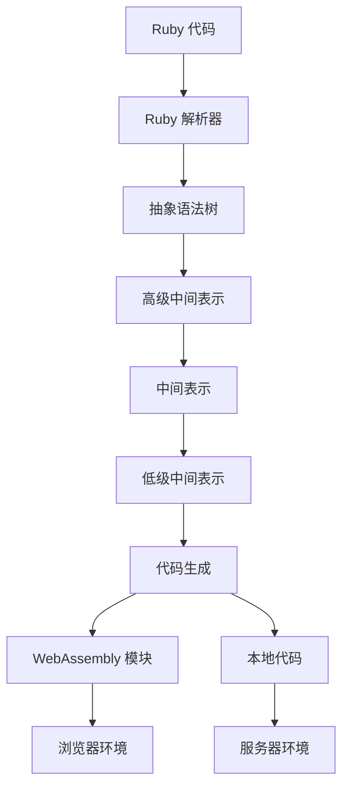

# 介绍

Rusty Ruby 是：

1. **一个用 Rust 实现的 Ruby 编译器和运行时**：提供高性能、类型安全的 Ruby 代码执行环境
2. **一个跨平台的 Ruby 实现**：支持在浏览器和服务器端运行 Ruby 代码

Rusty Ruby 旨在为 Ruby 生态带来新的可能性，通过 Rust 的性能优势和类型安全，提供更高效、更可靠的 Ruby 执行环境。

## 🚀 项目愿景

我们专注于：
- **高性能**：基于 Rust 实现，编译期优化，提供极致的性能表现
- **类型安全**：强类型设计，编译期检查，减少运行时错误
- **跨平台**：支持在浏览器、服务器等多种环境中运行
- **标准兼容**：支持标准 Ruby 语法，与现有 Ruby 代码兼容
- **易于集成**：与现有 Ruby 生态无缝集成

## 🏗️ 核心架构

项目采用分层抽象设计，确保关注点分离：



- **Ruby 解析器**: 负责将 Ruby 代码解析为抽象语法树
- **语义分析**: 进行类型检查和语义验证
- **中间表示**: 生成不同层次的中间表示，优化代码
- **代码生成**: 生成 WebAssembly 模块或本地代码
- **运行时**: 提供 Ruby 运行时环境和标准库

## 🛠️ 开始使用

### 1. 安装 Rusty Ruby

```bash
# 从源码构建
cargo install --path compilers/ruby-wasi

# 或使用预编译二进制文件
download rusty-ruby-<version>-<platform>.tar.gz
tar -xzf rusty-ruby-<version>-<platform>.tar.gz
```

### 2. 编写 Ruby 代码

创建 `hello.rb` 文件：

```ruby
puts 'Hello, Rusty Ruby!'

def greet(name)
  return "Hello, #{name}!"
end

puts greet('World')
```

### 3. 编译为 WebAssembly

```bash
rusty-ruby compile --target wasm hello.rb -o hello.wasm
```

### 4. 在浏览器中运行

```javascript
// 使用编译后的 WebAssembly 模块
const { RubyWASI } = require('@rusty-ruby/ruby-ts');

async function runRuby() {
  const ruby = await RubyWASI.load('hello.wasm');
  const result = await ruby.evaluate('puts "Hello from Rusty Ruby!"');
  console.log(result);
}

runRuby();
```

### 5. 在服务器端运行

```bash
rusty-ruby run hello.rb
```

## 📚 概念指南

要了解更多关于 Rusty Ruby 的核心概念和使用方法，请查看 **[概念指南](concepts/index.md)**。
